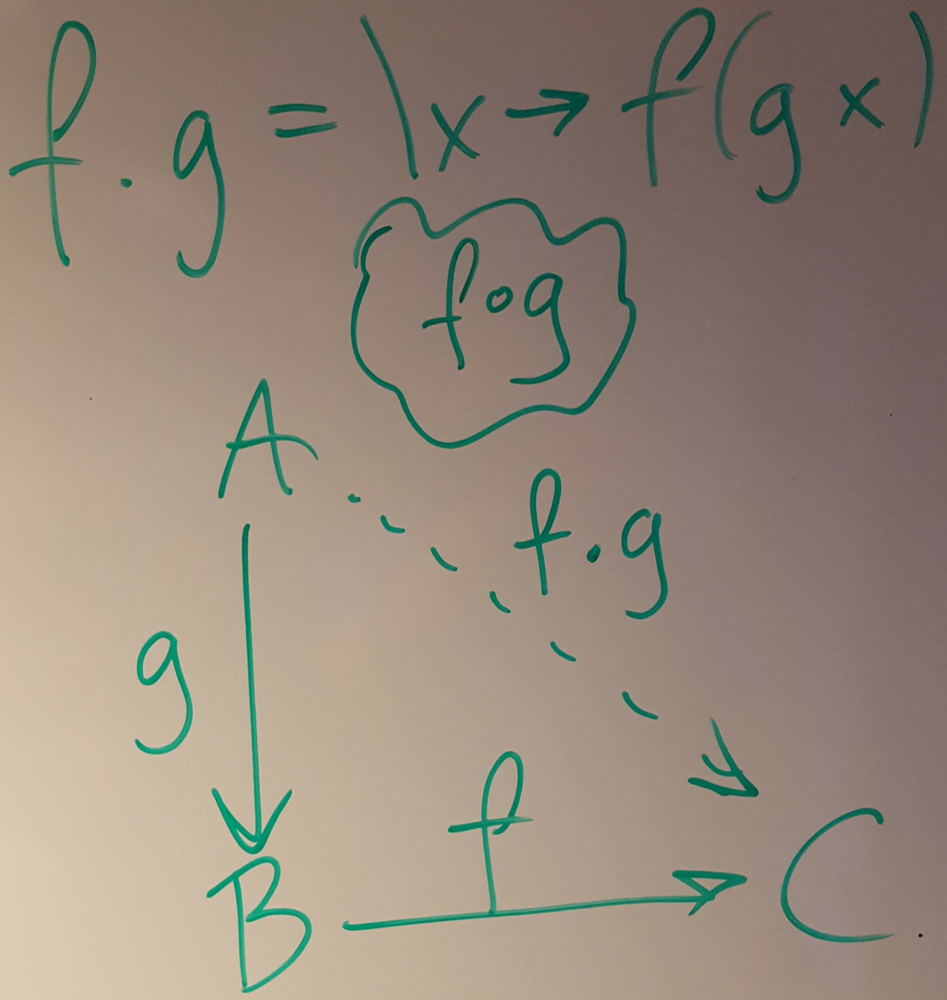

# Questions and answers from the exercise sessions week 1

## Function composition

The infix operator `.` in Haskell is an implementation of the
mathematical operation of function composition.

```Haskell
f . g = \x -> f (g x)
```

The dot is an ASCII approximation of the composition symbol ∘
typically used in mathematics. (The symbol ∘ is encoded as U+2218 and
called RING OPERATOR in Unicode, &#8728 in HTML, \circ in TeX, etc.)

The type is perhaps best illustrated by a diagram with types as nodes
and functions (arrows) as directed edges:



In Haskell we get the following type:

```Haskell
(.) :: (b->c) -> (a->b) -> (a->c)
```

which may take a while to get used to.

## fromInteger (looks recursive)

Near the end of the lecture notes there was an instance declaration
including the following lines:

```Haskell
instance Num r => Num (ComplexSyn r) where
  -- ...
  fromInteger = toComplexSyn . fromInteger
```

This definition looks recursive, but it is not. To see why we need to
expand the type and to do this I will introduce a name for the right
hand side (RHS): `fromIntC`.

```Haskell
--          ComplexSyn r <---------- r <---------- Integer
fromIntC =              toComplexSyn . fromInteger
```

I have place the types in the comment, with "backwards-pointing"
arrows indicating that
`fromInteger :: Integer -> r`
and
`toComplexSyn :: r -> ComplexSyn r`
while the resulting function is
`fromIntC :: Integer -> ComplexSyn r`.
The use of `fromInteger` at type `r` means that the full type of
`fromIntC` must refer to the `Num` class. Thus we arrive at the full
type:

```Haskell
fromIntC :: Num r =>   Integer -> ComplexSyn r
```

## type / newtype / data

There are three keywords in Haskell involved in naming types: `type`,
`newtype`, and `data`.

### type -- abbreviating type expressions

The `type` keyword is used to create a type synonym - just another
name for a type expression.

```Haskell
type Heltal = Integer
type Foo = (Maybe [String], [[Heltal]])
type BinOp = Heltal -> Heltal -> Heltal
type Env v s = [(v,s)]
```

The new name for the type on the RHS does not add type safety, just
readability (if used wisely). The `Env` example shows that a type
synonym can have type parameters.

### newtype -- more protection

A simple example of the use of `newtype` in Haskell is to distinguish
values which should be kept apart. A simple example is

```Haskell
newtype Age   = A Int  -- Age in years
newtype Shoe  = S Int  -- Shoe size (EU)
```

Which introduces two new types, `Age` and `Shoe`, which both are
internally represented by an `Int` but which are good to keep apart.

The constructor functions `A :: Int -> Age` and `S :: Int -> Shoe` are
used to translate from plain integers to ages and shoe sizes.

In the lecture notes we used a newtype for the semantics of complex
numbers as a pair of numbers in the cartesian representation but may
also be useful to have another newtype for complex as a pair of
numbers in the polar representation.

### data -- for syntax trees

Some examples:
```Haskell
data N = Z | S N
```
This declaration introduces

* a new type `N` for unary natural numbers,
* a constructor `Z :: N` to represent zero, and
* a constructor `S :: N -> N` to represent the successor.

Examples values: `zero = Z`, `one = S Z`, `three = S (S one)`

```Haskell
data E = V String | P E E | T E E
```
This declaration introduces

* a new type `E` for simple arithmetic expressions,
* a constructor `V :: String -> E` to represent variables,
* a constructor `P :: E -> E -> E` to represent plus, and
* a constructor `T :: E -> E -> E` to represent times.

Example values: `x = V "x"`, `e1 = P x x`, `e2 = T e1 e1`

If you want a contructor to be used as an infix operator you need to
use symbol characters and start with a colon:

```Haskell
data E = V String | E :+: E | E :*: E
```

Example values: `y = V "y"`, `e1 = y :+: y`, `e2 = x :*: e1`

Finally, you can add one or more type parameters to make a whole
family of datatypes in one go:

```Haskell
data ComplexSyn v r  =  Var v
                     |  FromCartesian r r
                     |  ComplexSyn v r  :+:  ComplexSyn v r
                     |  ComplexSyn v r  :*:  ComplexSyn v r
```

The purpose of the first parameter `v` here is to enable a free choice
of type for the variables (be it `String` or `Int` or something else)
and the second parameter `r` makes is possible to express "complex
numbers over" different base types (like `Double`, `Float`, `Integer`,
etc.).

## Env, Var, and variable lookup

The type synonym
```Haskell
type Env v s = [(v,s)]
```
is one way of expressing a partial function from `v` to `s`.

Example value:

```Haskell
env1 :: Env String Int
env1 = [("hej", 17), ("du", 38)]
```

The `Env`type is commonly used in evaluator functions for syntax trees
containing variables:

```Haskell
evalCP :: Env v (ComplexSem r) -> (ComplexSyn v r -> ComplexSem r)
evalCP env (Var x) = case lookup x env of ...
-- ...
```

Notice that `env` maps "syntax" (variable names) to "semantics", just
like the evaluator does.

##

```Haskell
```
