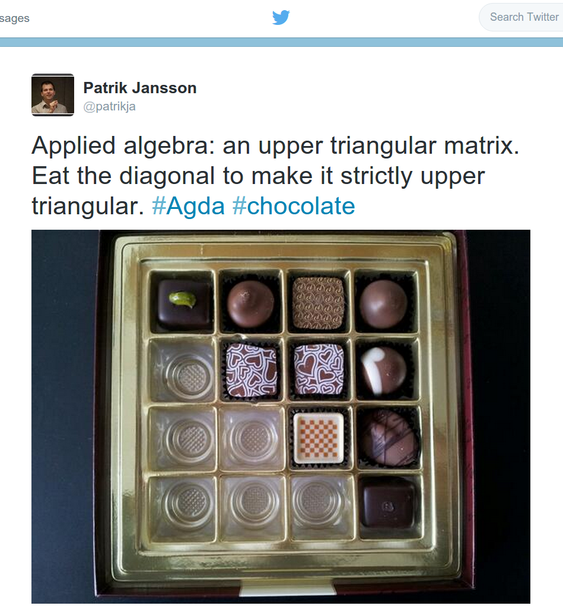

# Matematikens domänspecifika språk [DAT326](https://www.student.chalmers.se/sp/course?course_id=29865) / [DIT982](http://kursplaner.gu.se/english/DIT982.pdf)

(Presentation för D2, Må 2019-11-18 av Patrik Jansson.)

* Patrik Jansson: forskare och lärare inom Funktionell Programmering
    * examinator och kursansvarig för kursen DSLsofMath
    * XPA för D (2011–13), nu "inspektor" för D-sektionen
* LP3 i D2: ett första smakprov på programmets valfrihet
    * Vi tror på er förmåga att själva kombinera kurser till en bra helhet
    * Budskap: *Välj både DSLsofMath (i LP3) och ConcProg (i LP1)*
* Gästföreläsare:
    * Nicola Botta, adjungerad docent i Tyskland
    * Cezar Ionescu, AI professor i Tyskland (tidigare Oxford)

# Kursidé för "Matematikens domänspecifika språk"

Presentera klassiska matematiska ämnen från ett datavetenskapligt perspektiv:

* att tydligt beskriva de begrepp som introduceras,
* vara uppmärksam på syntax och typer,
* att bygga domänspecifika språk för: algebra, funktioner, derivator, polynom och potensserier, transformer
* att implementera (Haskell-)program för dessa områden (och därigenom nå en djupare förståelse)

Kursen är tänkt att ge en fördjupad matematisk förståelse för
datastudenter och en fördjupad datavetenskaplig förståelse för
matematikstudenter.

\begin{align*}
   f(x) &= 3*x^2
\\ g(x) &= \int_{x}^{2x} f(x) dx &= \int_{x}^{2x} f(y) dy
\end{align*}

# Historisk bakgrund och motivation för DSLsofMath

Det har under många år funnits en del problem med resultaten på
kurserna "Transformer" samt "Regler" i D3. Ett av målen med den här
nya kursen är att se till att förbereda er i D2 så att ni kan ta er an
hösten i trean med ett gott självförtroende på mattesidan.

Ett annat återkommande önskemål från D-studenter är en
"mellan-avancerad FP-kurs". DSLsofMath kan ses som ett naturligt steg
på vägen från grundkursen i FP till den avancerade FP-kursen (AFP).

# Resultatstatistik

* Resultat på DSLsofMath:
    * 2016: 28 reg., godkända: 68%
    * 2017: 43 reg., godkända: 58%
    * 2018: 39 reg., godkända: 89%
    * 2019: 59 reg., godkända: 73%

* Resultat i D3 (Transformer samt Regler)

| D3-kurs       | Valde inte DSL | Valde DSL | Godkänd DSL |
| ------------- | ----:| ---:| ---:|
| Transformer   | 36% | 57% | **77%**  |
| Regler        | 40% | 45% | **68%**  |

Dvs. de som tar DSL-kursen får mycket bättre resultat hösten i D3.

\small (Totalt 145 varav 'Valde inte DSL'=92, Valde=53, Godk.=34.)

# Student-citat

* "I feel like I have gotten a better understanding of mathematics, and how to make use of domain-specific languages."
* "The teachers (and assistants) were very engaging."
* "I found the 'alternative' perspective on common mathematical subjects in general to be very good. The part about logic and the part about linear algebra were my personal favorites."
* "Patrik is an excellent lecturer for the course."

"Jag läste DSLofMath för ett par år sedan och hade lite svårt att förstå syftet med kursen. Jag tyckte att den var lite luddig.

Nu har jag läst ... "Advanced Functional Programming", "Programming Language Technology", och "Types for Programs and Proofs", och nu förstår jag.

Kursen har verkligen varit till hjälp, även om jag inte var mogen att förstå det när det begav sig."


# Aktiva studier

* föreläsningar växlat med övningar + grupparbete.
* Aktiva studier: det räcker inte att bara "läsa (eller lyssna) och hålla med"
* *D är en bra bakgrund*: programmering och datavetenskap ~= matematisk problemlösning & logik
* plocka isär & reda ut begrepp -> källkod (funktioner och *typer*)
* datorn (kompilatorn) ger direkt återkoppling när något inte stämmer.

# Funktionell programmering (FP) och typer

* Typer (`Int`, `String`, `[Int]`, `a -> a -> a`, `[a -> a]`, ...)
* Rena funktioner som bas: från indata till utdata
* Historik: matematiska bevisverktyg och algoritmer
* Nutid: Konkurrensfördel, FP-experter eftertraktade!
* Vackert möte mellan matematik och maskin.

Undervisning på sv/en och implementering i Haskell.

```haskell

kvadrat x = x^2

twice f = \x -> f(f(x))

upphöjtFyra = twice kvadrat

test = upphöjtFyra 3

list = [(1+), (2*), kvadrat, upphöjtFyra]
```

# Funktionell programmering (FP) och *typer*

* Typer (`Int`, `String`, `[Int]`, `a -> a -> a`, `[a -> a]`, ...)
* Rena funktioner som bas: från indata till utdata
* Historik: matematiska bevisverktyg och algoritmer
* Nutid: Konkurrensfördel, FP-experter eftertraktade!
* Vackert möte mellan matematik och maskin.

```haskell
kvadrat      :: Num a =>  a -> a
kvadrat x    =  x^2
twice        :: (a -> a) -> (a -> a)
twice f      =  \x -> f(f(x))
upphöjtFyra  :: Num a =>  a -> a
upphöjtFyra  =  twice kvadrat
test         :: Double
test         =  upphöjtFyra 3
list         :: Num a =>  [a -> a]
list         =  [(1+), (2*), kvadrat, upphöjtFyra]
```

# Domänspecifika språk (DSL)

Exempel:

* datum:
    * Syntax: "2011-11-11", "tredje onsdagen i oktober", "nästa lördag"
    * Semantik: Date, eller kanske Date -> Date
* excel-formler:
    * Syntax: "SUM(A1:A9)", "RIGHT(LEFT(C7,4),2)", ...
    * Semantik: [ [ Cell ] ] -> Value
* integraler: [Behöver ritas!]
    * (notera var variablerna binds)

# Matematikens domänspecifika språk (DSLsofMath)

* linjär algebra:
    * vektorer, matriser, egenvärden, ...
* lite kategoriteori: funktioner och typer kan generaliseras till många olika delar av matematiken
* polynom och potensserier:
    * Syntax/representation: ändliga och oändliga listor av koefficienter
    * Semantik: funktioner (flera semantiker att välja på för samma syntax)
    * [Power series – power serious!](http://www.cs.dartmouth.edu/~doug/powser.html)
* komplexa tal (och transformer)
    * Algebra: En "imaginär enhet" i och några lagar (i^2 = -1, etc)
    * Geometri: rotation och skalning av punkter i planet
    * Två helt olika språk med samma semantik: de komplexa talen.

# Sammanfattning

Jag rekommenderar er att välja *både* DSLsofMath *och* ConcProg under
er utbildning, men att börja med DSLsofMath eftersom den ger er bättre
chanser att segla igenom D3 utan att gå på grund.

(De som tar DSL-kursen får mycket bättre resultat hösten i D3.)

Välkomna i januari önskar lärarlaget

  Patrik, Solrun, Victor


\begin{align*}
   f(x) &= x^2
\\ g(x) &= \int_{x}^{2x} f(x) dx &= \int_{x}^{2x} f(y) dy
\end{align*}

----------------

# Exempel på tillämpning: LinAlg, matris, maskininlärning



# Extra: Domänspecifika språk (DSL) i fo.&utv.

Exempel på lokal forsk. & utv. som kan beskrivas i termer av DSL:

* Lava för att beskriva hårdvarukretsar
* QuickCheck för automatisk testning
* [Feldspar](http://feldspar.github.io/) för digital signalbehandling
* GF för grammatiker och språkteknologi
* ...

Det finns också många företag som använder sig av, eller utvecklar
egna, domänspecifika språk.
