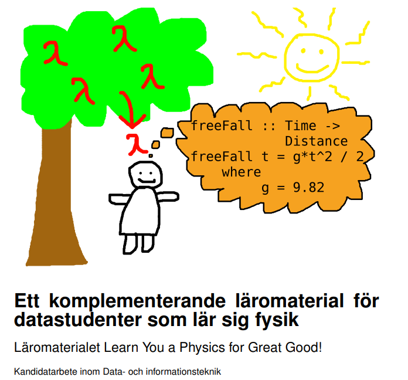
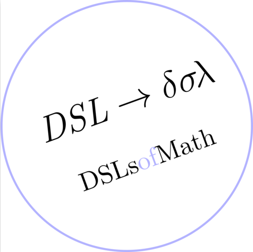
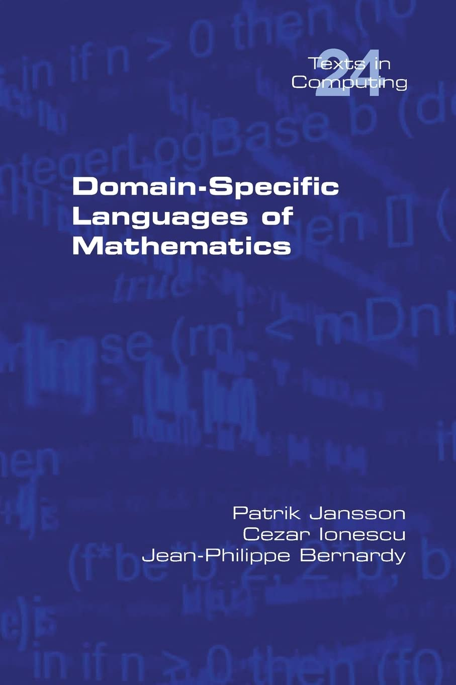

# Matematikens domänspecifika språk [DAT326](https://www.student.chalmers.se/sp/course?course_id=36211) / [DIT983](https://kursplaner.gu.se/pdf/kurs/en/DIT983)


(Presentation för D2, On 2023-11-15 av Patrik Jansson.)

* Patrik Jansson: forskare och lärare inom Funktionell Programmering
    * examinator och kursansvarig för kursen DSLsofMath
    * XPA för D (2011–13), "inspektor" för D-sektionen (-2021)
* LP3 i D2: ett första smakprov på programmets valfrihet
    * Vi tror på er förmåga att själva kombinera kurser till en bra helhet
    * Budskap: *Välj både DSLsofMath (nu i LP3) och PCP (sedan i D3, LP1)*
* Tidigare gästföreläsare:
    * Nicola Botta, Docent, Potsdam Institute of Climate Impact Research
    * Cezar Ionescu, Professor inom AI och funktionell programmering, Tyskland

# Kursidé för "Matematikens domänspecifika språk"

Presentera klassiska matematiska ämnen från ett datavetenskapligt perspektiv:

* att tydligt beskriva de begrepp som introduceras,
* vara uppmärksam på syntax och typer,
* att bygga domänspecifika språk för: algebra, funktioner, derivator, polynom och potensserier, transformer
* att implementera (Haskell-)program för dessa områden (och därigenom nå en djupare förståelse)

Kursen är tänkt att ge en fördjupad matematisk förståelse för
datastudenter och en fördjupad datavetenskaplig förståelse för
matematikstudenter.

\begin{align*}
   f(x) &= 3*x^2
\\ g(x) &= \int_{x}^{2x} f(x) dx &= \int_{x}^{2x} f(y) dy
\end{align*}

# Historisk bakgrund och motivation för DSLsofMath

Det har under många år funnits en del problem med resultaten på
kurserna "Transformer" samt "Regler" i D3. Ett av målen med den här
kursen är att se till att förbereda er i D2 så att ni kan ta er an
hösten i trean med ett gott självförtroende på mattesidan.

Ett annat återkommande önskemål från D-studenter är en
"mellan-avancerad FP-kurs". DSLsofMath kan ses som ett naturligt steg
på vägen från grundkursen i FP till den avancerade FP-kursen (AFP).

# Resultatstatistik

* Resultat på DSLsofMath (DAT326, 2017-2023):
    * 311 labbade varav 96% godkända
    * 280 tentade varav 65% godkända
\pause
* Resultat i D3 (Transformer samt Regler) 2018

| D3-kurs       | Valde inte DSL | Valde DSL | Godkänd DSL |
| ------------- | ----:| ---:| ---:|
| Transformer   | 36% | 57% | **77%**  |
| Regler        | 40% | 45% | **68%**  |

Dvs. de som tog DSL-kursen fick mycket bättre resultat hösten i D3.

\small (Totalt 145 varav 'Valde inte DSL'=92, Valde=53, Godk.=34.)

# Aktiva studier

* föreläsningar växlat med övningar + grupparbete.
* Aktiva studier: det räcker inte att bara "läsa (eller lyssna) och hålla med"
* *D är en bra bakgrund*: programmering och datavetenskap ~= matematisk problemlösning & logik
* plocka isär & reda ut begrepp -> källkod (funktioner och *typer*)
* datorn (kompilatorn) ger direkt återkoppling när något inte stämmer.

# Funktionell programmering (FP) och typer

* Typer (`Int`, `String`, `[Int]`, `a -> a -> a`, `[a -> a]`, ...)
* Rena funktioner som bas: från indata till utdata
* Historik: matematiska bevisverktyg och algoritmer
* Nutid: Konkurrensfördel, FP-experter eftertraktade!
* Vackert möte mellan matematik och maskin.

Undervisning på sv/en och implementering i Haskell.

```haskell

kvadrat x    =  x^2

twice f      =  \x -> f(f(x))

upphöjtFyra  =  twice kvadrat

test         =  upphöjtFyra 3

list         =  [(1+), (2*), kvadrat, upphöjtFyra]
```

# Funktionell programmering (FP) och *typer*

* Typer (`Int`, `String`, `[Int]`, `a -> a -> a`, `[a -> a]`, ...)
* Rena funktioner som bas: från indata till utdata
* Historik: matematiska bevisverktyg och algoritmer
* Nutid: Konkurrensfördel, FP-experter eftertraktade!
* Vackert möte mellan matematik och maskin.

Undervisning på sv/en och implementering i Haskell.

```haskell
kvadrat      :: Num a =>  a -> a
kvadrat x    =  x^2
twice        :: (a -> a) -> (a -> a)
twice f      =  \x -> f(f(x))
upphöjtFyra  :: Num a =>  a -> a
upphöjtFyra  =  twice kvadrat
test         :: Double
test         =  upphöjtFyra 3
list         :: Num a =>  [a -> a]
list         =  [(1+), (2*), kvadrat, upphöjtFyra]
```

# Domänspecifika språk (DSL)

Exempel:

* datum:
    * Syntax: "2023-11-18", "tredje lördagen i november", "nu på lördag"
    * Semantik: Date, eller kanske Date -> Date
* excel-formler:
    * Syntax: "SUM(A1:A9)", "RIGHT(LEFT(C7,4),2)", ...
    * Semantik: [ [ Cell ] ] -> Value
* integraler:

  \includegraphics[width=5cm]{integral_scope.png}

# Matematikens domänspecifika språk (DSLsofMath) för andra ämnen

Inspirerat av den här kursen har flera studentgrupper genomfört kandidatarbetesprojekt under de senaste åren med följande resultat:

+ 2016: \small Programmering som undervisningsverktyg för Transformer, signaler och system - [Utvecklingen av läromaterialet TSS med DSL](https://hdl.handle.net/20.500.12380/243894)
  J Jonsson, J Olsson, F Lindahl, P Ngo, C Rosvall
+ 2018: Ett komplementerande läromaterial för datastudenter som lär sig fysik - [Läromaterialet Learn You a Physics for Great
Good!](https://hdl.handle.net/20.500.12380/256122)
  J Johansson, O Lundström, E Sjöström, B Werner
+ 2020: A Computer Science Approach to Teaching Control Theory - Developing Learning Material Using Domain-Specific Languages
  S Hägglund, J A Fihlman, E Ohlman, F Nylander, C Josefsson, T Räjert
+ 2022: HasLin - ett DSL för linjär algebra - Utvecklandet av ett matematiskt domänspecifikt språk för linjär algebra i Haskell
  A Eliasson, D Nikolaev, F Nordmark, S Sjögren, L Sundkvist

Några av er kanske också vill gå den vägen, eller ta del av deras material.

# Exempel: 2018: Learn you a physics for great good ...
Johan Johansson, Oskar Lundström, Erik Sjöström, Björn Werner

{ height=80% }

# Sammanfattning

Jag rekommenderar er att välja *både* DSLsofMath *och* PCP under
er utbildning, men att börja med DSLsofMath eftersom den ger er bättre
chanser att segla igenom D3 utan att gå på grund.

(De som tar DSL-kursen får mycket bättre resultat hösten i D3.)

Välkomna i januari önskar lärarlaget

  Patrik, m.fl.

\vspace*{-0.8cm}
{height=40%}
{height=50%}

----------------

# Exempel på tillämpning: LinAlg, matris, maskininlärning

{height=80%}

# Extra: Domänspecifika språk (DSL) i fo.&utv.

Exempel på lokal forsk. & utv. som kan beskrivas i termer av DSL:

* Lava för att beskriva hårdvarukretsar
* QuickCheck för automatisk testning
* [Feldspar](http://feldspar.github.io/) för digital signalbehandling
* GF för grammatiker och språkteknologi
* ...

Det finns också många företag som använder sig av, eller utvecklar
egna, domänspecifika språk.
